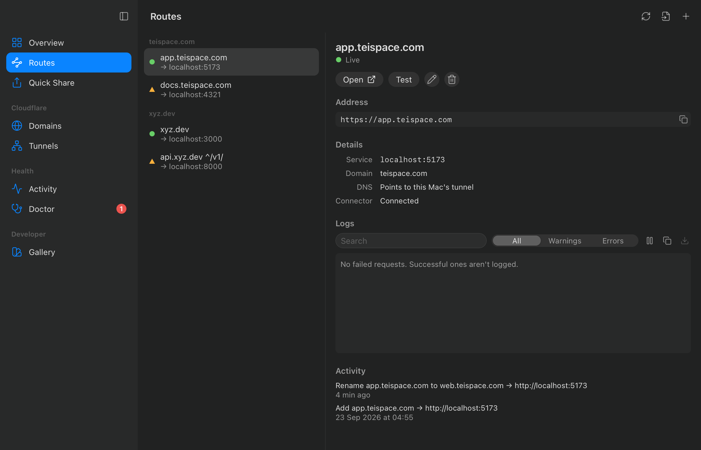
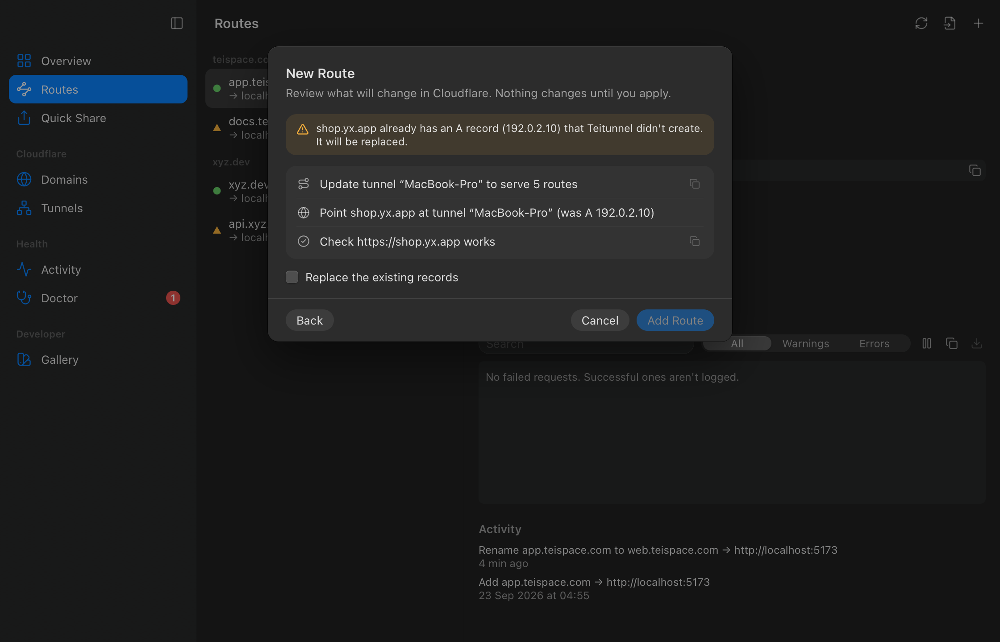
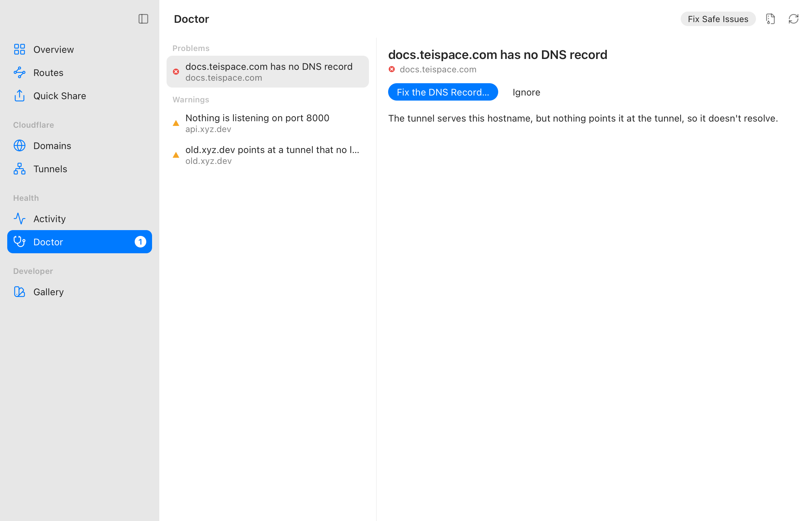

# Teitunnel

**A native desktop app for Cloudflare Tunnel.** Put any local app on your own domain in under a minute, and keep it clean, healthy and under control.

> **Status: developer preview.** Quick Share, routes on your own domains, the Doctor and always-on connectors work on macOS; signed releases come with v1.0. See the [roadmap](docs/ROADMAP.md) and [current status](docs/STATUS.md).

<p align="center">
  
</p>

## What it does

- **Quick Share:** expose `localhost:3000` at a public `trycloudflare.com` URL in one click, with a QR code and no account needed.
- **Routes across all your domains:** `app.xyz.com → localhost:3000`, `api.yx.com → localhost:5000`, served from one tunnel on your machine. Teitunnel creates the tunnel, configuration and DNS records for you.
- **See before you change:** every change is shown as a plan before it touches your Cloudflare account, and can be undone.
- **No mess:** DNS records Teitunnel creates are tracked and removed when you remove a route. Orphaned records from old tunnels are found and flagged.
- **Doctor:** detects closed origin ports, DNS conflicts, pending nameservers, blocked QUIC, crash loops, config drift and more, with one-click fixes.
- **Knows your machine:** detects running dev servers and Docker containers and suggests them as origins. Imports existing `cloudflared` setups.
- **Always-on:** keep tunnels running after quitting the app or rebooting, managed by macOS launchd.
- **Live insight:** request rates, errors, latency, edge locations and structured logs.
- **Native:** built to feel like it shipped with macOS. Keyboard-first, menu bar extra, light and dark.

<p align="center">
  
  
</p>
- **Private and secure:** credentials live in your OS keychain. No telemetry and no Teitunnel servers.

## Install

Get the app for macOS, Windows or Linux from the [download page](https://teitunnel.teispace.com/download/), or:

```sh
brew install --cask teispace/tap/teitunnel         # macOS app (signed and notarized)
brew install teispace/tap/teitunnel-cli            # the CLI only, macOS or Linux
docker run -d -e CLOUDFLARE_API_TOKEN -v teitunnel:/data ghcr.io/teispace/teitunnel
```

Every file is also on [GitHub Releases](https://github.com/teispace/teitunnel/releases), with checksums and build provenance ([verify a download](https://teitunnel.teispace.com/docs/reference/verify/)).

Teitunnel uses [cloudflared](https://github.com/cloudflare/cloudflared). If you don't have it, Teitunnel installs Cloudflare's official release for you (verified against the published checksum and Cloudflare's code signature).

## Platforms

macOS first (v1.0), then Windows and Linux.

## Built with

Tauri 2 · Rust · React · TypeScript · Tailwind CSS. See [docs/ARCHITECTURE.md](docs/ARCHITECTURE.md).

## Development

Requirements: macOS 14+ (Linux and Windows build too), Rust (pinned in `rust-toolchain.toml`, installed automatically by rustup), Node 26+ and pnpm 12.

```sh
git clone https://github.com/teispace/teitunnel && cd teitunnel
pnpm install      # JS deps + git hooks
pnpm dev          # run the app with hot reload
```

| Command | What it does |
|---|---|
| `pnpm dev` | Run the desktop app in development mode |
| `pnpm build` | Build the packaged app (`target/release/bundle/`) |
| `pnpm check` | Biome, TypeScript and Clippy |
| `pnpm test` | Vitest and `cargo nextest` |
| `pnpm fmt` | Format everything |
| `pnpm bindings` | Regenerate the typed IPC bindings after changing Rust commands |

Install `cargo-nextest` once with `cargo install cargo-nextest --locked`. The in-app component gallery is under **Developer → Gallery** in development builds.

## Contributing

Contributions are welcome. Start with [CONTRIBUTING.md](CONTRIBUTING.md) and [docs/README.md](docs/README.md).

## Security

Please report vulnerabilities privately. See [SECURITY.md](SECURITY.md).

## License

[MIT](LICENSE) © teispace

Teitunnel is an independent open-source project and is not affiliated with or endorsed by Cloudflare, Inc. "Cloudflare" is a trademark of Cloudflare, Inc.
