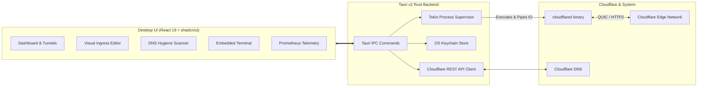

<div align="center">

# 🚇 Teitunnel

**The Definitive Open-Source Desktop Control Center for Cloudflare Tunnels (`cloudflared`)**

[](https://github.com/teispace/teitunnel)
[](LICENSE)
[](https://github.com/teispace/teitunnel)
[](https://tauri.app)
[](https://react.dev)
[](https://tailwindcss.com)

*Expose local servers, manage Zero Trust tunnels, route domains, clean dangling DNS records, and monitor live edge telemetry — all from a blazing-fast native desktop app.*

[Features](#-key-features) • [Architecture](#-architecture) • [Getting Started](#-getting-started) • [Documentation](#-documentation) • [Contributing](#-contributing)

</div>

---

## 🌟 Why Teitunnel?

Cloudflare Tunnels (`cloudflared`) are the modern standard for exposing local development servers and private microservices securely to the public internet without port forwarding or static IPs. However, managing them via CLI leads to messy YAML configuration files, orphaned DNS CNAME records, and zero visual monitoring.

**Teitunnel** eliminates that friction with a sleek, native desktop cockpit:
- ⚡ **1-Click Ephemeral Tunnels**: Instant `trycloudflare.com` port forwarding without requiring a Cloudflare account or API token. Includes QR code sharing!
- 🌐 **Remotely-Managed Zero Trust Tunnels**: Full integration with Cloudflare API v4. Create, edit, start, stop, and configure tunnels directly on Cloudflare's Edge.
- 🔀 **Visual Ingress Rule Builder**: Point and click to map domains, paths, and protocols (HTTP, HTTPS, TCP, SSH, RDP, Unix sockets) to local ports without touching YAML.
- 🧹 **The "No-Mess" DNS Engine & Hygiene Scanner**: Automatic CNAME provisioning when linking routes, automatic cascade cleanup on deletion, and an orphaned-record scanner that prevents subdomain takeover risks.
- 📊 **Real-Time Telemetry & Prometheus Scraping**: Monitor active Cloudflare Edge Colos (SJC, FRA, LHR), RTT latency charts, request counters, and HTTP status codes.
- 💻 **Embedded Terminal & Colored Log Stream**: Full terminal emulator (xterm.js) and high-performance virtualized live log viewer with search, log level filtering, and pause/resume.
- 🔒 **Native OS Keychain Security**: API tokens are encrypted inside Apple Keychain, Windows Credential Manager, or Linux Secret Service — zero plaintext tokens on disk.

---

## 🚀 Key Features

| Feature | Description |
| :--- | :--- |
| **Instant Sharing (Try Instantly)** | Forward any local port (3000, 8080, etc.) to an ephemeral `trycloudflare.com` URL with 1-click copy and mobile QR code. |
| **Binary Self-Management** | Auto-detects existing `cloudflared` or automatically downloads and updates the managed binary for macOS, Linux, and Windows. |
| **Visual Ingress Builder** | Rule-based routing table with protocol switches, custom header injection, TLS bypass toggles, and catch-all 404 enforcement. |
| **DNS Hygiene Scanner** | Audits your Cloudflare zones for dead `*.cfargotunnel.com` CNAME pointers and offers 1-click batch cleanup. |
| **Process Supervision** | Rust Tokio-powered process supervisor with auto-restart, graceful shutdown, and background daemon support. |
| **System Tray / Menu Bar** | Quick-access tray menu with 1-click tunnel start/stop toggles and connection health indicators. |

---

## 🏗 Architecture



For full details, read [docs/ARCHITECTURE.md](docs/ARCHITECTURE.md).

---

## 🏁 Getting Started

### Prerequisites
- **Node.js**: v20+ (v22+ recommended)
- **Package Manager**: `pnpm` (v9+)
- **Rust Toolchain**: `rustc` and `cargo` 1.80+

### Development Setup

1. **Clone the repository**:
   ```bash
   git clone https://github.com/teispace/teitunnel.git
   cd teitunnel
   ```

2. **Install frontend dependencies**:
   ```bash
   pnpm install
   ```

3. **Run in development mode**:
   ```bash
   pnpm tauri dev
   ```

4. **Build production app**:
   ```bash
   pnpm tauri build
   ```
   *The compiled desktop installer (`.dmg` for macOS, `.msi`/`.exe` for Windows, `.deb`/`.AppImage` for Linux) will be generated in `src-tauri/target/release/bundle/`.*

---

## 📚 Documentation

- [Architecture & Design](docs/ARCHITECTURE.md)
- [Project Roadmap & Milestones](docs/ROADMAP.md)
- [Security Policy & Credential Handling](docs/SECURITY.md)
- [Contributor & AI Agent Guidelines](AGENTS.md)

---

## 🤝 Contributing

We welcome contributions from the community! Check out our [Roadmap](docs/ROADMAP.md) for planned features and good first issues.

1. Fork the repo (`https://github.com/teispace/teitunnel`)
2. Create your feature branch (`git checkout -b feature/amazing-feature`)
3. Commit your changes (`git commit -m 'feat: add amazing feature'`)
4. Push to the branch (`git push origin feature/amazing-feature`)
5. Open a Pull Request

---

## 📄 License

Teitunnel is open-source software licensed under the **[MIT License](LICENSE)**.

---

<div align="center">
  Built with ❤️ by the <a href="https://github.com/teispace">teispace</a> community.
</div>
