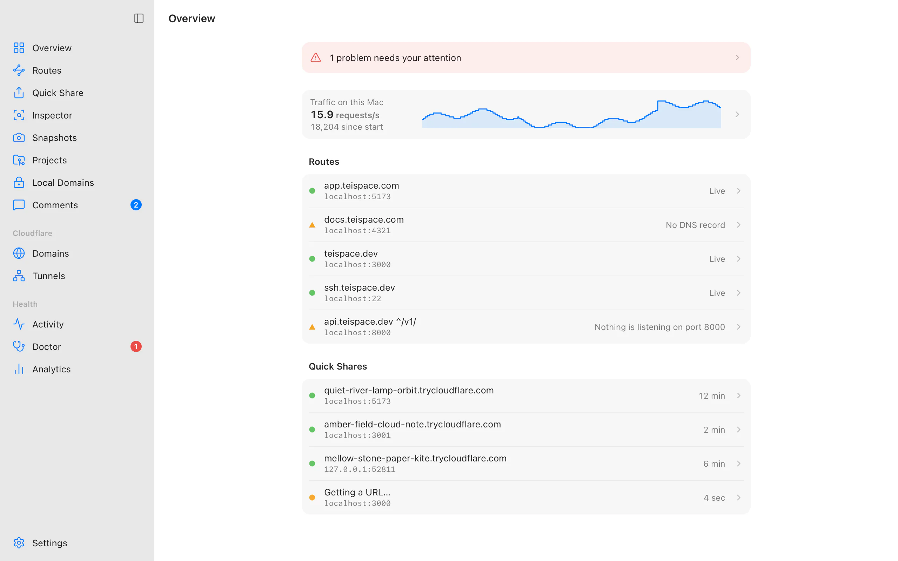

<div align="center">


# Teitunnel

**Share, publish and protect your local work, with Cloudflare Tunnel.**

A free, open-source desktop app and command line for Cloudflare Tunnel on macOS, Windows and Linux.

[](https://github.com/teispace/teitunnel/actions/workflows/ci.yml)
[](https://github.com/teispace/teitunnel/releases/latest)
[](LICENSE)

[Website](https://teitunnel.teispace.com) ·
[Documentation](https://teitunnel.teispace.com/docs/) ·
[Download](https://teitunnel.teispace.com/download/) ·
[Discussions](https://github.com/teispace/teitunnel/discussions) ·
[Changelog](CHANGELOG.md)

</div>

<picture>
  <source media="(prefers-color-scheme: dark)" srcset="apps/web/public/screens/overview-dark.webp">
  
</picture>

## Why Teitunnel

Cloudflare Tunnel puts a service on the internet without opening a port, but using it means
juggling tunnels, connectors, ingress rules, DNS records and access policies across a CLI,
YAML files and a dashboard. Teitunnel turns that into one step: say which local service
should answer at which address, review the plan, and it's live. It runs on your own
Cloudflare account, with no Teitunnel servers in between and no telemetry.

## Features

- **Share in one click.** A random `trycloudflare.com` address with no account, or a
  stable name on your own domain, with a QR code, protection and an expiry.
- **Routes on your domains.** Any number of hostnames on one tunnel per computer. Every
  change is shown as a plan first, applied with rollback, and can be undone.
- **Nothing left behind.** Teitunnel only deletes what it created, finds DNS records that
  point at deleted tunnels, and cleans up everything attached to a hostname with it.
- **The Doctor.** Finds closed ports, DNS conflicts, blocked QUIC, crash loops and dev
  servers that refuse your hostname, and fixes them in place.
- **Inspector.** Every request and WebSocket message with timings, replay and edit, mocks,
  breakpoints and signature checks for webhooks, all on your computer.
- **Publish.** Static Snapshots, an offline page and a webhook inbox on your own Cloudflare
  account, so things keep working while your computer is off.
- **Protect.** Logins with Cloudflare Access, service tokens, and bot, AI-crawler and rate
  limit rules for one hostname.
- **Local HTTPS domains.** `https://shop.test` or `app.localhost` with a certificate your
  browsers trust.
- **For AI agents.** An MCP server for Claude Code, Cursor, VS Code and more, where every
  change waits for your approval and secrets never reach the agent.
- **Everywhere you work.** A menu bar app, the `teitunnel` command for servers and CI, a
  Docker image, `teitunnel.yml` project files, and extensions for VS Code, JetBrains IDEs,
  Raycast and browsers.

## Install

| Platform | |
|---|---|
| **macOS** 14 or later | [Download](https://teitunnel.teispace.com/download/) the signed, notarized app, or `brew install --cask teispace/tap/teitunnel` |
| **Windows** 10 and 11 | [Download](https://teitunnel.teispace.com/download/) the installer (x64 or Arm64) |
| **Linux** | `.deb`, `.rpm` and AppImage from the [download page](https://teitunnel.teispace.com/download/), or the [apt and dnf repositories](https://teitunnel.teispace.com/docs/getting-started/install/) |
| **Servers and CI** | `brew install teispace/tap/teitunnel-cli`, the [release archives](https://github.com/teispace/teitunnel/releases/latest), or `docker run teispace/teitunnel` |

Every release is on [GitHub Releases](https://github.com/teispace/teitunnel/releases) with
checksums and build provenance ([how to verify a download](https://teitunnel.teispace.com/docs/reference/verify/)).
Teitunnel installs Cloudflare's official `cloudflared` for you when it isn't there, after
checking its checksum and signature.

## Quick start

```sh
teitunnel share 3000                          # a public URL for localhost:3000, no account needed
teitunnel setup                               # connect a Cloudflare account (token kept in the keychain)
teitunnel share 3000 --on demo.example.com    # a share on your own domain
teitunnel route add app.example.com 3000      # a route that stays
```

Or open the app and choose **Quick Share**. The [getting started guide](https://teitunnel.teispace.com/docs/getting-started/quick-share/)
walks through both.

## Documentation

- [User documentation](https://teitunnel.teispace.com/docs/): guides, tutorials, the CLI
  reference and troubleshooting.
- [Contributor documentation](docs/): architecture, design system, conventions and the
  security model.

## Community

- **Questions and ideas:** [GitHub Discussions](https://github.com/teispace/teitunnel/discussions).
- **Bugs and feature requests:** [issues](https://github.com/teispace/teitunnel/issues/new/choose).
- **Security reports:** privately, as described in [SECURITY.md](SECURITY.md).
- **What's planned:** [milestones](https://github.com/teispace/teitunnel/milestones).

Everyone taking part is expected to follow the [Code of Conduct](CODE_OF_CONDUCT.md).

## Contributing

Contributions of every size are welcome, from typo fixes to new features. Read the
[contributing guide](CONTRIBUTING.md) to set up the project, and look for
[good first issues](https://github.com/teispace/teitunnel/labels/good%20first%20issue)
to start with.

## License

Teitunnel is released under the [MIT License](LICENSE).

Teitunnel is an independent open-source project and is not affiliated with or endorsed by
Cloudflare, Inc. "Cloudflare" is a trademark of Cloudflare, Inc.
