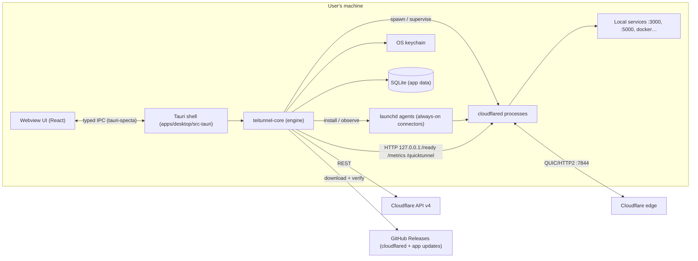

# Architecture

This is the source of truth for how Teitunnel is built. When the code and this document disagree, fix one of them in the same PR.

---

## 1. System context



There is no Teitunnel backend. The app talks only to Cloudflare, GitHub, and processes on localhost.

---

## 2. Repository & crate boundaries

```
crates/cf-api        Typed Cloudflare REST client. Knows HTTP + JSON. Knows nothing about tunnels-as-a-product.
crates/cloudflared   Everything about the cloudflared binary: locate, install, verify, command building,
                     log/metrics parsing, local endpoints, config.yml + credentials files.
crates/core          The product: domain model, engine (observe → plan → apply → verify), runtime
                     (supervisor, services), discovery, doctor, store, secrets, events.
crates/lens          Lens, the local inspecting reverse proxy: taps, capture, masking,
                     replay, exports, webhooks, gates, stubs, breakpoints, simulation. Pure library, no Tauri,
                     no core; an optional `specta` feature derives IPC types.
crates/localdomains  Local HTTPS domains: the name-constrained CA, leaves issued per SNI
                     name, trust installers per OS (privileged steps returned as data), the `.test`
                     name server, mDNS, port checks. No Tauri, no SQLite, no proxying; `core`
                     persists and serves through Lens.
crates/mcp           The MCP server for AI agents (rmcp): tools, resources, prompts, approvals,
                     redaction, the Streamable HTTP endpoint, and AI-client config writers. Talks
                     to Teitunnel through its `Backend` trait (`CoreBackend` over core); tools
                     come from `ToolProvider`s, traffic from a `TrafficSource`.
crates/control       The local control connection: newline-delimited JSON-RPC 2.0 over a
                     Unix socket / named pipe only the user can open, the server (auth, limits,
                     approvals) over a `Host` trait, `ControlClient`, and `teitunnel://` links.
                     Knows nothing about the core; `core::control::CoreHost` implements `Host`.
apps/cli             `teitunnel`: commands only; hosts the MCP server (`teitunnel mcp`, `/mcp`);
                     uses the running app through `ControlClient` (`share`, `shares`, `routes`,
                     `status`, `top`, `local-domain`).
apps/desktop/src-tauri  Thin adapter: IPC commands, events bridge, tray, menus, windows, plugins.
apps/desktop/src        React UI.
tools/fake-cloudflared  Test double binary that behaves like cloudflared (endpoints, JSON logs, failure modes).
```

**Dependency rules** (enforced by review, and by `cargo deny` bans where possible):

```
desktop ──▶ core ──▶ cf-api
                 └─▶ cloudflared
```

- `cf-api` and `cloudflared` never depend on each other, on `core`, or on Tauri.
- `core` never depends on Tauri. It exposes a plain async Rust API, which keeps it unit-testable and lets a future CLI reuse it.
- `control` depends on nothing of Teitunnel's (so extensions' protocol, the CLI's client and the Windows pipe code stay small and checkable alone); `core` depends on it to implement its `Host` (`core::control`), and the shell only supplies native dialogs, windows and change events through `core::control::Ui`.
- `mcp` depends on `core` (and `cf-api`/`cloudflared` types), never on Tauri; `cli` hosts it, and the desktop app can host it later through the same `Backend`.
- `src-tauri` contains **no business logic**. A command is: parse args → call `core` → map result.
- The UI never talks to Cloudflare or the filesystem directly. Only IPC.

`core` is structured as ports and adapters:

| Port (trait in core) | Production adapter | Test adapter |
|---|---|---|
| `CloudApi` | wraps `cf_api::Client` | in-memory fake with scripted state |
| `SecretStore` | `keyring` | in-memory map |
| `ServiceManager` | launchd (macOS), systemd --user (Linux), Task Scheduler (Windows) | recording fake |
| `Clock` | system | manual clock |
| `PortScanner` | `listeners` + `sysinfo` | fixed list |

---

## 3. Domain model

User-facing nouns: **Account, Domain (zone), Route, Tunnel, Connector, Quick Share, Local Service.**

```rust
// Sketches. Exact fields are defined in crates/core/src/domain.
struct AccountId(String);           // Cloudflare account id
struct ZoneId(String);
struct TunnelId(Uuid);
struct RouteId(Uuid);               // Teitunnel-generated, stable, written into DNS comments

enum CredentialSource { OAuth, ApiToken, CertPem { path: PathBuf } }  // secret material lives in keychain

struct Tunnel {
    id: TunnelId, account: AccountId, name: String,
    config_source: ConfigSource,     // Remote (Cloudflare) | LocalFile(PathBuf)
    this_machine: bool,              // a connector for it is managed on this machine
    run_mode: Option<RunMode>,       // Session | AlwaysOn (only if this_machine)
    metrics_port: Option<u16>,       // stable per tunnel, allocated from 20300..20399
}

struct Route {                       // one ingress rule + its DNS record
    id: RouteId, tunnel: TunnelId,
    hostname: Hostname, zone: ZoneId,   // app.xyz.com in zone xyz.com; wildcards allowed (*.xyz.com)
    path: Option<PathRegex>,
    origin: Origin,
    options: OriginOptions,          // noTLSVerify, originServerName, httpHostHeader, timeouts, …
    access: Option<AccessPolicy>,    // v1.x
}

enum Origin {
    Http { url: Url }, Https { url: Url }, Tcp { addr: SocketAddr }, Ssh { addr }, Rdp { addr }, Smb { addr },
    Unix { path: PathBuf, tls: bool }, HelloWorld, HttpStatus(u16),
}

struct QuickShare { id: Uuid, origin: Origin, url: Option<Url>, started_at: Timestamp, stop_at: Option<Timestamp> }
```

**Multi-domain rule:** a tunnel's ingress may contain hostnames from any zone in the same account. The default setup is one tunnel per machine with N routes across M zones, served by one `cloudflared` process.

**Source of truth:**
- Tunnel ingress config lives on **Cloudflare** (remote-managed; `PUT …/configurations`).
- DNS lives on **Cloudflare**.
- Process state is **observed live** on this machine.
- **SQLite** stores only what Cloudflare can't: ownership index, run modes, metrics ports, last-applied config versions, activity log, preferences, metric rollups.

Because Cloudflare stays authoritative, two machines (or the dashboard) can edit the same account without Teitunnel's database becoming a stale copy.

---

## 4. The engine: observe → plan → apply → verify

All mutations go through one pipeline. No command calls the Cloudflare API ad hoc.

```
Intent ──┐
         ├─▶ Planner (pure) ──▶ Plan ──▶ [user reviews] ──▶ Executor ──▶ Verifier
Observed ┘                                                      │
                                                          Activity log + events
```

### 4.1 Intent

What the user asked for, in product terms:

`AddRoute`, `UpdateRoute`, `RemoveRoute`, `ReorderRoutes`, `CreateTunnel`, `DeleteTunnel`, `SetRunMode`, `RepairDns{hostname}`, `Cleanup{items}`, `ImportLocalTunnel`, `AdoptProcess`, `ProtectRoute` (v1.x) …

Snapshots add `PublishSnapshot`, `UpdateSnapshot`, `RollbackSnapshot` and `DeleteSnapshot` (§4.8).
Edge protection adds `ProtectHostname`, `CreateServiceToken`, `RevokeServiceToken` and `RotateServiceToken` (§4.9).

### 4.2 Observed snapshot

A consistent read of reality for the affected scope: tunnels + connections, the tunnel's current remote config **with its `version`**, the relevant DNS records (by name and by `*.cfargotunnel.com` content), the ownership index, local connector state and local listening ports. Each snapshot carries a **fingerprint** (a hash of the parts the plan depends on).

### 4.3 Planner

`fn plan(intent, observed, policy) -> Result<Plan, PlanError>`. It's pure and deterministic, with no I/O.

```rust
struct Plan { id, intent, fingerprint, steps: Vec<Step>, warnings: Vec<Warning>, requires_confirmation: bool }

enum Step {
    CreateTunnel { name },                       FetchTunnelToken { tunnel },
    PutTunnelConfig { tunnel, config, expected_version },
    CreateDnsRecord { zone, name, target, proxied, comment },
    UpdateDnsRecord { zone, record, target },    DeleteDnsRecord { zone, record, owned: bool },
    StartConnector { tunnel, mode },             StopConnector { tunnel },
    InstallService { tunnel },                   UninstallService { tunnel },
    DeleteTunnel { tunnel },                     CleanupConnections { tunnel },
    VerifyHostname { hostname },
}
```

Planner rules:
- **Ordering:** create tunnel → token → config → DNS → start → verify. Removal runs in reverse: config (drop rule) → DNS → stop/delete if empty.
- **Ingress ordering:** rules are sorted by specificity (exact host before wildcard, longer path before shorter). The catch-all `http_status:404` is always last. Manual order is allowed in Advanced mode.
- **DNS conflicts:** an existing A/AAAA/CNAME on the hostname that we don't own produces `requires_confirmation` with the existing record shown. It is never overwritten silently.
- **Idempotent:** planning the same intent against an already-converged state yields an empty plan ("Nothing to change").
- **Private networks:** `CreateNetworkRoute`/`DeleteNetworkRoute` route a CIDR range to this Mac's tunnel in the default virtual network (creating the tunnel first if needed). Removing the tunnel deletes the ranges routed to it before the connector stops. Only routes to this Mac's tunnel are ever removed.
- **Text:** steps, warnings and errors carry `Text` (catalog key + arguments), never English sentences; the UI translates them.
- **Verify** is planned only for routes a browser can open; SSH/RDP/SMB/TCP routes show `cloudflared access` commands instead.
- Every step has a human description and a "Copy as command" rendering (`cloudflared …` or `curl` for the API).

### 4.4 Executor

- One plan executes at a time **per account** (async mutex).
- **Staleness guard:** before applying, it re-observes the affected scope. If the fingerprint changed, it re-plans. If the new plan differs, the user reviews again.
- Config writes use `expected_version` from the snapshot. A concurrent remote edit becomes a conflict, not a silent overwrite.
- Every step is appended to the activity log (`pending → running → done | failed | compensated`) and emitted as a progress event.
- **Rollback:** each step type defines a compensating action (`CreateDnsRecord ↔ DeleteDnsRecord(owned)`, `PutTunnelConfig ↔ PutTunnelConfig(previous)`, `CreateTunnel ↔ DeleteTunnel`). On failure, completed steps are compensated in reverse order. The result is reported as either "rolled back cleanly" or "partially applied" with the exact leftovers listed, and a Doctor issue is raised.
- Transient failures (429 with `Retry-After`, 5xx, network errors) are retried inside the step with backoff. 4xx errors fail the step.
- **Several new DNS records** (an import, or any plan with consecutive `CreateRecord` steps) go to Cloudflare's [batch endpoint](https://developers.cloudflare.com/dns/manage-dns-records/how-to/batch-record-changes/): one call per zone, up to 200 records, applied all or none. The plan keeps one step per record, each with its own progress and undo, so rollback works as for single steps.

### 4.5 Verifier

End-to-end probe for a hostname, reported by stage so failures are actionable:

1. **DNS:** read the record through the API and confirm it's a proxied CNAME to this Mac's tunnel. The verifier never resolves the hostname itself: a lookup made before the record propagated caches NXDOMAIN for up to 30 minutes in the Mac's and ISP's resolvers.
2. **Edge → tunnel:** HTTPS GET sent straight to a Cloudflare edge address (from resolving `api.cloudflare.com`) with the hostname as SNI and Host. Cloudflare error 1033 means no connector; 530/1016 means DNS/tunnel mismatch; 1001 means not on Cloudflare yet; a certificate error on a multi-level subdomain means Universal SSL doesn't cover it.
3. **Tunnel → origin:** 502/504 means the origin is unreachable. The probe cross-checks that the local port is listening and names the port. Cloudflare's own 413 page means a body over the plan's limit; 429 on a Quick Share means its 200 in-flight requests are used up.
4. **Origin:** any other status is a success, and the status code is shown, unless the answer is a dev server refusing the address (`dev_server::detect`: Vite, webpack-dev-server, Rails, Django from a bounded read of the body; Next.js by asking for a `/_next/` resource with the public `Origin`). That's a failure with its fix: the Host header the server expects (where sending it is safe) and the config line that allows the address. A `text/event-stream` answer is flagged (Quick Shares don't carry it).

Transient failures (1033, 1016/530, 1001) are retried every 2 s for a short patience window after apply (`Engine::verify`).

### 4.6 Drift

Teitunnel stores the remote config `version` it last applied for each tunnel. A higher version appears when someone edited via the dashboard, another machine or the API. That's drift. The UI shows a diff (last applied vs current) with **Keep theirs** (adopt) or **Restore mine** (plan a PUT).

### 4.7 Ownership ("no mess")

- Every DNS record Teitunnel creates carries the comment `teitunnel:route=<RouteId>` and is indexed in SQLite.
- **Only owned records are ever deleted automatically.** Records pointing at `*.cfargotunnel.com` that aren't owned are reported by Doctor ("points to deleted tunnel X"). Deleting them needs explicit confirmation.
- The comment makes ownership recoverable. On a new machine or after a DB loss, re-scanning zones rebuilds the index.
- Tunnels created by Teitunnel are recorded in SQLite, and their name uses the user-chosen name. Teitunnel doesn't claim tunnels it didn't create, but it can manage them after an explicit import.

---

### 4.8 Snapshots

A Snapshot is a static copy of a site hosted on the user's own account as a **Worker with
static assets** ([Workers static assets](https://developers.cloudflare.com/workers/static-assets/)).
`core::snapshot` prepares the files (a folder, a project's build through a typed
`<manager> run <script>` command, or a bounded same-origin crawl of a local site), hashes
them, and keeps them in memory under an id while the plan is reviewed. The engine
(`engine/sites.rs`, `engine/planner/sites.rs`) plans:

- publish: `UploadSnapshotFiles` → `CreateSnapshotWorker` → login (Access) → `DeleteRecord`
  (a foreign record, with confirmation) → `AttachSnapshotDomain` | `EnableWorkersDev`;
- update: login → `UploadSnapshotFiles` → `PublishSnapshotVersion` (upload a version, then
  deploy it: the atomic switch) → address repair → remove login;
- rollback: `RollBackSnapshot` (deploy an older version id);
- delete: `DisableWorkersDev` → `DetachSnapshotDomain` → remove login → `DeleteSnapshotWorker`
  (last: it can't be undone).

Uploads send only the hashes Cloudflare asks for, re-read and re-hash each file (a file
changed since the preview fails the step), and stream `StepState::Transferring`. Undo:
delete the new Worker, redeploy the previous version, re-attach or detach domains, toggle
workers.dev back. The Worker (`engine/snapshot-worker.js`) runs only for a password or the
comments overlay (`run_worker_first`); otherwise assets are served without it.

Comments (`core::comments`): the overlay script (`comments/overlay.js`) and one JSON API
under `/__teitunnel/comments/`, answered by Lens's `ReservedHandler` for live shares and
inspected routes (kept in the local store, migration 19) and by the Snapshot Worker for
Snapshots (kept in the account's D1 database, bound as `DB`; a planned `CreateDatabase`
step makes it the first time). The app reads Snapshot comments with the D1 query endpoint.

Workers in front of a route (`engine/front.rs`, `engine/planner/front.rs`): the offline page
and webhook inboxes are Worker scripts (`tt-offline-…`, `tt-inbox-…`) on Worker routes
(`hostname/*`, `hostname/path*`) that proxy to the tunnel. Plans: `CreateDatabase` (an inbox's
first) → `PutFrontWorker` → `CreateWorkerRoute`; removal `DeleteWorkerRoute` →
`DeleteFrontWorker`, and removing a hostname's last route removes them. Ownership is the
`front_workers` index (migration 20). `core::inbox` delivers kept webhooks to the route's
own service.

### 4.9 Edge protection and service tokens

Rules Cloudflare enforces for **one hostname** (the
[Ruleset Engine](https://developers.cloudflare.com/ruleset-engine/)): a custom rule that blocks
automated clients and/or AI crawlers, one that challenges them
(`http_request_firewall_custom`), request and response header rules
(`http_request_late_transform`, `http_response_headers_transform`), each
`(http.host eq "<hostname>") and (…)` and described `teitunnel:<route-id>:<kind>`; and rate
limits (`http_ratelimit`), which plans allow few of, **shared** by every hostname with the
same limit in a zone: one rule per limit, `(http.host in {"a" "b"})`, described
`teitunnel:ratelimit:<requests>-<period>-<action>`. `engine/edge.rs` builds the rules and
reads settings back from them; `engine/planner/edge.rs` diffs them against the observed
entry points (`EdgeState`: the zone's plan from `plan.legacy_id`, and five phases) and
plans `CreateEdgeRule` → `UpdateEdgeRule` → `DeleteEdgeRule` (from the end of each phase,
so undo re-inserts every rule at its old position), checks each quota and adds
`Warning::EdgeQuota`. Free zones get no rate limit (it can't match a hostname there); a
different limit on a full quota is `PlanError::EdgeRateLimitConflict`. Rules are changed
one by one (`POST`/`PATCH`/`DELETE …/rules/{id}`), never a whole ruleset; a rule is
Teitunnel's if its description has the marker or its id is in `edge_rules`.

Service tokens: `CreateServiceToken` → `AllowServiceToken` (adds the new token to the
Service Auth policy, decision `non_identity`, of Teitunnel's Access application for the
hostname, or creates an application only tokens pass); revoke is `UpdateAccessApp` (or
`DeleteAccessApp` when nothing is left) → `DeleteServiceToken` (last: irreversible).
`Engine::apply_issuing` returns the credentials of tokens created or rotated, only when
the plan applied; they're never stored or recorded. Route edits keep the Machines policy
(`keep_machines`), and removing a route's login keeps a machine-only application while
tokens use it. `core::protection` is the service layer the app, the CLI and agents share;
the app keeps a new secret in `IssuedSecrets` (memory, 10 minutes) and copies it to the
clipboard from Rust, so it never crosses IPC.

## 5. Runtime

### 5.1 Connectors (one `cloudflared` process per tunnel on this machine)

State machine:

```
Stopped ─start─▶ Starting ─spawned─▶ Connecting ─ready≥1─▶ Healthy
   ▲                 │                    │                 │  ▲
   │              fail/exit           timeout           ready=0 │ ready≥1
   │                 ▼                    ▼                 ▼  │
   └──stop──── Stopping ◀──stop──── Crashed(backoff) ◀── Degraded
```

- **Spawn:** `cloudflared tunnel --no-autoupdate --output json --loglevel info --metrics 127.0.0.1:<port> run`, spawned directly with `tokio::process` (tests use `tools/fake-cloudflared`). The token is passed via the `TUNNEL_TOKEN` environment variable, **never in argv**. `kill_on_drop`, own process group. See `crates/cloudflared/src/command.rs`.
- **Metrics port:** each tunnel gets a stable port from `20300..20399` (Quick Shares use `20400..20499`), stored in SQLite and checked free at start. This avoids cloudflared's default `20241..20245`, so adopted foreign processes don't collide.
- **Health:** poll `GET /ready` every 250 ms until the first connection, then every 2 s (JSON `readyConnections`). `Healthy` needs ≥ 1; `Degraded` is 0 while the process is alive.
- **Logs:** JSON lines on stderr are parsed into `LogEvent { ts, level, message, fields }`. They go into a per-connector ring buffer (100k events) and are fanned out to subscribers.
- **Metrics:** scrape `/metrics` every 1 s while a traffic view polls (a 5 s lease per read), otherwise every 10 s. Values go into a ring buffer (3,600 samples), and 1-min rollups are persisted for 7 days.
- **Restarts:** exponential backoff with jitter (1 s → 60 s cap). More than 5 crashes in 2 min is a **crash loop**: raise a Doctor issue with the last 50 log lines and wait, retrying every 10 min or at once when the network changes (a laptop offline for a few minutes loops too).
- **Sleep, wake and network changes** (`runtime::network`): the supervisor looks every 5 s for the wall clock jumping ahead (the computer slept) and for its routable addresses changing, and nudges every connector: a backoff or crash loop ends at once, and a running connector with no connection 15 s later is restarted (not Quick Shares, whose address would change). `core::health` stays quiet for 90 s after such a change.
- **Shutdown:** SIGTERM, then SIGKILL after 5 s. On app exit (`RunEvent::ExitRequested`), stop all Session connectors concurrently within the deadline.

### 5.2 Run modes

| | Session | Always-on |
|---|---|---|
| Owner | Teitunnel process (supervisor) | launchd (macOS) / systemd --user (Linux) / Task Scheduler (Windows) |
| Survives app quit / reboot | No / No | Yes / Yes |
| Token delivery | `TUNNEL_TOKEN` env | `--token-file` (0600, app data dir) |
| Observed via | child handle + endpoints | fixed metrics port endpoints + service status |
| Logs | stderr pipe | `--log-directory` (rotating) + tail |

macOS always-on: `~/Library/LaunchAgents/com.teispace.teitunnel.connector.<tunnel-id>.plist` with `RunAtLoad`, `KeepAlive`, `ProgramArguments` pointing at the managed binary, managed through `launchctl bootstrap/bootout gui/<uid>`.

### 5.3 Quick Share

`cloudflared tunnel --config <data dir>/quick-share.yml --no-autoupdate --output json --metrics 127.0.0.1:<port> [--http-host-header <host>] --url <origin>`. The config file is Teitunnel's own, empty (`{}`), rewritten at every start, so a leftover `~/.cloudflared/config.yml` (whose ingress rules would win over `--url`) is never read. The public URL comes from `GET /quicktunnel` → `{"hostname": "…trycloudflare.com"}`, polled until present, with a 20 s timeout. Once live, the share is checked once through the edge like a route (§4.5) and the result is kept on the share. New shares of Vite, webpack-dev-server and Angular dev servers (from discovery) send the server's own address as the Host header unless told otherwise; changing the header restarts the share's cloudflared, which gives it a new URL. Several Quick Shares can run at once, one process each. Optional auto-stop timer.

With the inspector (default, setting **Inspect Quick Shares**; per share `inspect`), `--url` is the share's Lens tap (`http://127.0.0.1:<random>`), which forwards to the origin and sets the Host header itself (Lens `HostHeader::Custom`), so changing the header updates the tap at once and keeps the URL. Turning inspection on or off restarts cloudflared (new URL).

### 5.5 The inspector (`core::inspect`)

One `Inspector` per process (the app, `teitunnel share`/`inspect`/`serve`/`mcp`) owns a lazily started Lens. Taps have a scope: a Quick Share (tap id = share id) or a route (`rt-<digest>-<random>`, new each run). Captures live in Lens's ring (1,000 per tap) through `inspect::history::Captures`, which also sends finished exchanges, masked (`record.rs`: credential headers, secret query/form/JSON values, token-like strings; text bodies decoded and masked; 64 KiB per body), to a writer task that batches them into `lens_exchanges` (24 h by default, 5,000 per tap, 256 MB in all); `load()` restores recent history into memory at start. Other processes read that table (`history*` functions: `teitunnel traffic`). Settings are one JSON value (`inspector`) in `settings`.

- **Routes** (`inspect::routes`): inspecting is an `UpdateRoute` through plan → apply pointing the service at the tap (access and origin options kept); the original service is stored first in `inspected_routes` with the owner (`app` or a CLI process). Reverted on off, on quit (the app sweeps its own rows before exiting), at the next launch (rows from the last run), and when a CLI owner exits (swept every 30 s). The Doctor's `inspect.orphan` reports a rule still pointing at a tap address nobody listens on, fixed by the stored restore change.
- **Events**: taps changed, watched path hit, idle limit reached (the host stops the share: `QuickShares::watch_idle`, the app for domain shares, the CLI for its own).
- **Live view**: `inspect::follow` coalesces Lens events into `LiveBatch`es every 100 ms (IPC `inspect_subscribe` Channel).
- **Secrets**: webhook signing secrets per scope (`host:<hostname>` or `origin:<service>`) and provider, and bearer tokens per hostname, only in the keychain (`inspect::secrets`).
- **Analytics**: `inspect::analytics::LensSource` answers first for routes a tap inspects.
- **Presets** (`inspect::expose`): MCP server probe (Streamable HTTP `initialize`, SSE `endpoint`), local AI server probe (Ollama, LM Studio, vLLM), client configurations, and exposing a service on a domain share through a bearer-gated tap.

### 5.5a Local HTTPS domains (`core::local_domains`)

`LocalDomains` (one per process that serves them: the app, `teitunnel local-domain add|serve`) serves the `local_domains` registry through the process's `Inspector`: each domain is a hosted tap (`TapScope::LocalDomain`, `ld-<digest>-<random>`, `Inspector::start_hosted`; capture on only with `inspect`), and two listeners route by host: HTTPS (443, else 8443) with `CheckedTls` (rustls through `tokio-rustls`, certificates from `localdomains::SniResolver` over a `DomainRegistry` of the HTTPS domains, so a handshake for any other name fails) and plain HTTP (80, else 8080) with Lens's `Routing::HttpsRedirect` (308 to HTTPS for HTTPS domains, served for HTTP-only ones). Both acceptors check the peer before anything is read: loopback and this computer's interface addresses (`if-addrs`) always; private-network peers only with LAN access on, and over TLS only for `.local` SNI. Listeners bind loopback (`127.0.0.1` plus `::1`), or the wildcard address when macOS refuses a low port on loopback, a `.local` domain exists or LAN access is on. `.test` names get a `DnsResponder` on `127.0.0.1:53535` (53 on Windows) and `.local` names an `MdnsAdvertiser`. The CA is loaded or made once (`LocalCa::load_or_create`, key through `KeychainCaStore` over `SecretStore`, account `localdomains:ca`; its public certificate at `<data>/localdomains/ca.pem` for the installers); leaves live only in memory (30 days, renewed 10 days before expiry). `run()` ticks every 30 s: restarts dead listeners, renews hourly and after a wake (a gap of more than 90 s), re-advertises mDNS and refreshes the peer check's addresses. Trust goes through a `TrustBackend` port (`SystemTrust` over `localdomains::TrustManager`; `FileTrust` when `TEITUNNEL_TEST_TRUST_FILE` is set). The `.test` resolver entry, the Linux system store and low-port fixes are `PrivilegedAction`s shown as copyable commands, run through `pkexec` on Linux with consent. The Doctor adds `local.*` checks (`local_domains::diagnose`) with `Fix::LocalDomains`. Project files' `localDomains` are applied by `project::apply_local_domains`; backups copy the table. The CLI saves to the registry and asks the running app to `localDomains.reload`, or serves from the terminal.

### 5.6 Adoption of foreign processes

At startup and on demand, `sysinfo` finds running `cloudflared` processes not started by Teitunnel. We probe candidate metrics ports (`20241..20245` plus any `--metrics` found in the process arguments) and show them as **Discovered** with Import / Adopt / Ignore. We never read secrets from other processes' arguments or environment.

---

## 6. Accounts & credentials

- An **Account** is a Cloudflare account reachable with one credential. Multiple accounts are supported, with one active at a time in the UI and all of them active in the engine.
- **Credential sources**, in the order the UI offers them:
  1. **OAuth 2.0 Authorization Code + PKCE (S256)**, public client registered by teispace. Loopback redirect `http://127.0.0.1:<port>/callback` on a small fixed set of registered ports, since Cloudflare requires exact redirect matching and rejects custom schemes. Refresh token goes in the keychain; access token is held in memory and refreshed ahead of expiry. Sign-out revokes the token.
  2. **API token.** "Create token" opens the dashboard with a pre-filled template URL (`permissionGroupKeys`, name "Teitunnel"). The pasted token is verified (`/user/tokens/verify`) and stored in the keychain.
  3. **cert.pem import** (from `cloudflared tunnel login`). The PEM `ARGO TUNNEL TOKEN` block is base64 JSON with `zoneID`, `accountID` and `apiToken`. Treated as a **limited** credential (one zone), and labelled as such.
- **Capability map.** After connecting, Teitunnel probes what the credential can do (`tunnels:edit`, `dns:edit(zone)`, `zones:read`, `access:edit` …). Features the credential can't support are disabled in the UI with a one-line reason and a "Fix permissions" link.
- Keychain layout: service `com.teispace.teitunnel`, account `cf:<account-id>:<kind>`. Tunnel run tokens use `tunnel:<tunnel-id>`.

---

## 7. Discovery

| What | How | Used for |
|---|---|---|
| Listening TCP ports + PID | `listeners` crate | Origin picker, "origin not listening" checks |
| Process name, cmdline, cwd | `sysinfo` | Labels ("vite · my-app"), project name from `package.json`/`Cargo.toml` in cwd |
| Docker containers + published ports | `bollard` (socket auto-detected: Docker Desktop, OrbStack, Colima) | Origin picker with container names |
| Existing cloudflared setup | `~/.cloudflared/*`, `/etc/cloudflared/*`, `/usr/local/etc/cloudflared/*` | Import (config.yml, credentials JSON, cert.pem) |
| Running cloudflared | `sysinfo` | Adoption |
| Installed services | launchd plists / systemd units referencing cloudflared | Import / conflict warnings |

Discovery results are snapshots, refreshed when a picker opens and on a 5 s interval while visible. It never runs as a hot loop in the background.

---

## 8. Doctor

```rust
trait Check { fn id(&self) -> CheckId; async fn run(&self, ctx: &CheckCtx) -> Vec<Issue>; }
struct Issue { id, check, severity: Info|Warning|Error, subject: Subject, title, detail, evidence: Vec<Evidence>, fix: Option<Intent> }
```

- Checks are pure functions over gathered facts in `crates/core/src/doctor.rs` (`gather`, then `diagnose`); `doctor_monitor.rs` runs them in the background.
- A **fix is an Intent**, so it goes through the planner: previewed, logged and rollback-safe.
- "Fix all safe issues" only applies fixes whose plans touch nothing but owned resources and need no confirmation.
- Checks run on app start, after every apply, on connector state changes, and on demand. They are cheap and share one observed snapshot.

Every check, with its fix, is listed in the [Doctor reference](https://teitunnel.teispace.com/docs/reference/doctor/).

---

## 9. Persistence

SQLite (`rusqlite`, bundled) at `<app_data>/teitunnel.db`, WAL mode, file mode 0600, forward-only migrations (`rusqlite_migration`), all access on a dedicated blocking thread.

| Table | Purpose |
|---|---|
| `accounts` | id, name, credential kind, added_at (no secrets) |
| `tunnels_local` | tunnel_id, account_id, created_by_us, this_machine, run_mode, metrics_port, last_applied_version |
| `dns_ownership` | record_id, zone_id, hostname, route_id, tunnel_id, created_at |
| `routes_meta` | route_id ↔ (tunnel_id, hostname, path): stable ids, since Cloudflare ingress rules have none |
| `activity` | id, ts, plan_id, intent, step, status, error, before/after JSON |
| `quick_shares` | history (origin, url, start/stop) |
| `snapshots` | Snapshots Teitunnel published: account, name, Worker, hostname, source, settings flags (no password), expiry, live version |
| `snapshot_versions` | the last 10 versions per Snapshot: Cloudflare version id, manifest (path → hash, size), `_headers`/`_redirects` |
| `edge_rules` | ownership index of Teitunnel's edge rules: rule id, zone, phase, hostname (none for a shared rate limit), kind (migration 15) |
| `service_tokens` | Teitunnel's Access service tokens: id, hostname, name, client id, expiry; never the secret (migration 15) |
| `metrics_rollup` | tunnel_id, minute, requests, errors, status_2xx…5xx, concurrent_max, connections_min, rtt_sum_ms, rtt_samples |
| `inspected_routes` | routes pointed at an inspector: account, hostname, path, tunnel, original service, login, tap address, owner (§5.5) |
| `lens_taps` | taps this machine ran: id, scope, name, service, public URL, owner, start/stop |
| `lens_exchanges` | the inspector's history, masked (§5.5): id, tap, seq, time, method, host, path, status, kind, meta JSON, bodies |
| `local_domains` | local HTTPS domains: name, target JSON (port, URL), wildcard, https, inspect, project, created_at (migration 17; the CA key is in the keychain) |
| `settings` | key/value JSON |

App data dir on macOS: `~/Library/Application Support/com.teispace.teitunnel/` (`bin/`, `tokens/` (0700), `teitunnel.db`). Logs go to `~/Library/Logs/com.teispace.teitunnel/`.

---

## 10. IPC contract

- **Types are generated.** `tauri-specta` exports every command and event to `apps/desktop/src/lib/ipc/bindings.ts`. CI regenerates the file and fails on diff. Nobody hand-writes IPC types.
- **Naming:** `<area>_<verb>`, e.g. `routes_list`, `routes_plan_add`, `plans_apply`, `quick_share_start`, `binary_install`.
- **Errors:** every command returns `Result<T, AppError>`.
  ```rust
  struct AppError { code: ErrorCode, message: String, hint: Option<String>, field: Option<String>, fix: Option<Intent> }
  ```
  Cloudflare error codes map to human messages in `core`, e.g. 81053 → "A DNS record with this name already exists".
- **Secrets never cross IPC.** Commands take `AccountId`, never tokens. The only exception is `accounts_add_token(token)` (input only), which never echoes the token back.
- **Change notification:** one typed event, `EntityChanged { kind, id? }`, is emitted after anything changes. The UI maps `kind` to TanStack Query keys and invalidates them. No hand-written sync code.
- **Streams:** logs, metrics and plan progress use `tauri::ipc::Channel<T>` per subscription, batched every ~100 ms, and cancelled when the subscriber drops.
- **Long operations** (binary download, plan apply, verify) return immediately with an operation id, then report progress on a channel.

### 10.1 Control connection

The app listens (unless Settings ▸ Integrations turns it off) on `<data>/control/sock`
(Unix socket, 0600, in a 0700 folder; peers must run as the same uid) or a named pipe with
a random name recorded in `<data>/control/pipe` (DACL: the current user only; remote
clients refused; first instance). `<data>/control/token` (0600, made once per install) is
presented in `hello`. Messages are newline-delimited JSON-RPC 2.0, at most 1 MiB; `hello`
must come within 5 s; requests are rate-limited per connection (token bucket 40/20 s⁻¹,
12 changes a minute, 8 in flight, 32 connections) and time out (60 s, changes 180 s).

| Method | Core call |
|---|---|
| `status`, `shares.list` | accounts, local tunnels + connector state, `QuickShares::list`, domain shares, `cli_shares::list` |
| `shares.start` / `shares.stop` | `QuickShares::start`, or `start_folder` for a `folder` (checked again; waits for the URL) / `stop`, `domain_shares::stop`, `cli_shares::stop` |
| `routes.list` | `Engine::overview` |
| `routes.preview` / `routes.apply` | `intent_for` → `preview` / `apply` by fingerprint, `with_actor(via: "control")` |
| `open` | `Ui::open` → `OpenView` event → the webview navigates |
| `doctor.run` | `doctor::run` plus local-domain issues, minus ignored issues |
| `localDomains.list` / `localDomains.reload` | `LocalDomains::status` / `sync` then `status` (no approval: it only re-reads the app's own database) |
| `events.subscribe` | notifications from `EntityChanged` (shares, routes) and `requestArrived` (inspector) |

Changes (`shares.start`, `shares.stop`, `routes.apply`) go through the server's gate:
unless the client's name is in `integrations.clients` ("Always Allow"), the host asks with a
native dialog (`Ui::confirm`, a sheet on the main window); `confirmed: true` (records
Teitunnel didn't create) is asked every time. `teitunnel://` links go through the same host
(`deeplink::LinkHandler`): sharing always asks, never "always", one question at a time;
opening a view doesn't ask. The `tauri-plugin-deep-link` scheme is registered by the
bundles (Info.plist, NSIS registry, `.desktop` MimeType); single-instance forwards links to
the running app on Windows and Linux. Settings keys `controlEnabled`, `deepLinksEnabled`,
`controlClients` live in the `settings` table (no migration).

The CLI connects with `ControlClient` (`apps/cli/src/app.rs`): `share` uses the app when it
answers (`--app` requires it, `--here` never), `shares`/`routes`/`status`/`top` read
through it. Shell completion (`teitunnel __complete`, scripts from `completions`) reads
names from the database read-only (`core::completion`) and never the network.

---

## 11. Frontend architecture

```
src/
  app/          providers (QueryClient, Router, Theme, Platform), shortcuts, menu-event bridge
  routes/       TanStack Router file routes: thin, compose features, own search params
  features/<f>/ components/, hooks/, queries.ts (query keys + hooks), schemas.ts (zod), index.ts (public API)
  components/ui/        primitives (shadcn-derived, re-tokened), no business logic
  components/patterns/  composites: AppShell, SplitView, Inspector, ListRow, PlanPreview, CopyField, StatusDot…
  lib/ipc/      bindings.ts (generated), client.ts, events.ts, query-keys.ts
  lib/          format, validation, platform, cn
  styles/       tokens.css, platform-macos.css, globals.css
```

Rules:
- **Server state** (anything from Rust) lives only in TanStack Query. **UI state** (selection, panes, palette) lives in Zustand or the URL. Router search params hold filters, so views are linkable and restorable.
- A feature imports other features only through their `index.ts`. `components/*` never import from `features/*`.
- Components stay small, with a guideline of ~200–250 lines. Split out when a component gains a second responsibility.
- Every route is lazy-loaded. The initial bundle contains the shell, primitives and the Overview.
- Forms use react-hook-form + zod for instant shape validation, plus debounced `*_validate` IPC calls for semantic checks. Rust validates again on apply.
- Lists over 200 rows use `@tanstack/react-virtual`. Charts use uPlot (canvas).

---

## 12. Platform layer

- `crates/core/src/platform/{macos,linux,windows}.rs` covers service manager, data paths, process signals and binary asset names, selected with `cfg`.
- `apps/desktop/src-tauri/src/shell/` covers window effects, tray, menus and notifications per OS.
- macOS, Windows and Linux are all supported. Every change must build and pass tests on the three systems in CI, and the release workflow installs and launches the packaged app on each.

---

## 13. Observability of the app itself

- `tracing` with a daily rolling file appender (7 files) at the OS log directory (`~/Library/Logs/com.teispace.teitunnel/` on macOS). A redaction layer scrubs anything that looks like a token or `Authorization` header.
- **Export diagnostics** produces a zip of app logs (redacted), a Doctor report, versions, and `cloudflared tunnel diag` output for a selected connector. It's generated locally and never uploaded automatically.
- There is no telemetry, analytics or crash upload.

---

## 14. Performance budgets

| Metric | Budget |
|---|---|
| Cold start → interactive | < 500 ms on Apple silicon, no splash |
| Idle memory (app only) | < 120 MB |
| Initial JS (gzip) | < 250 KB |
| Log viewer | 2,000 lines/s sustained at 60 fps, 100k retained |
| UI-path IPC command | < 50 ms, otherwise async + progress |
| Installer (dmg) | < 15 MB. cloudflared is downloaded on demand. |

Bundle size is checked in CI. Startup and memory are measured manually per release and recorded in the release notes.

The desktop package declares `sideEffects` (only CSS and `main.tsx`), so importing one hook or badge through a feature's `index.ts` doesn't pull that feature's pages into the initial JS. A new module that must run only for its side effects has to be added there.
