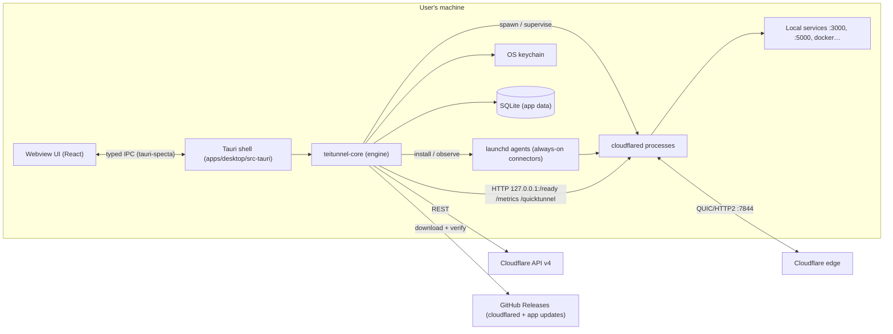

# Architecture

This is the source of truth for how Teitunnel is built. When the code and this document disagree, fix one of them in the same PR.

---

## 1. System context



There is no Teitunnel backend. The app talks only to Cloudflare, GitHub, and processes on localhost.

---

## 2. Repository & crate boundaries

```
crates/cf-api        Typed Cloudflare REST client. Knows HTTP + JSON. Knows nothing about tunnels-as-a-product.
crates/cloudflared   Everything about the cloudflared binary: locate, install, verify, command building,
                     log/metrics parsing, local endpoints, config.yml + credentials files.
crates/core          The product: domain model, engine (observe → plan → apply → verify), runtime
                     (supervisor, services), discovery, doctor, store, secrets, events.
apps/desktop/src-tauri  Thin adapter: IPC commands, events bridge, tray, menus, windows, plugins.
apps/desktop/src        React UI.
tools/fake-cloudflared  Test double binary that behaves like cloudflared (endpoints, JSON logs, failure modes).
```

**Dependency rules** (enforced by review, and by `cargo deny` bans where possible):

```
desktop ──▶ core ──▶ cf-api
                 └─▶ cloudflared
```

- `cf-api` and `cloudflared` never depend on each other, on `core`, or on Tauri.
- `core` never depends on Tauri. It exposes a plain async Rust API, which keeps it unit-testable and lets a future CLI reuse it.
- `src-tauri` contains **no business logic**. A command is: parse args → call `core` → map result.
- The UI never talks to Cloudflare or the filesystem directly. Only IPC.

`core` is structured as ports and adapters:

| Port (trait in core) | Production adapter | Test adapter |
|---|---|---|
| `CloudApi` | wraps `cf_api::Client` | in-memory fake with scripted state |
| `SecretStore` | `keyring` | in-memory map |
| `ServiceManager` | launchd (macOS), systemd --user (Linux), Task Scheduler (Windows) | recording fake |
| `Clock` | system | manual clock |
| `PortScanner` | `listeners` + `sysinfo` | fixed list |

---

## 3. Domain model

User-facing nouns: **Account, Domain (zone), Route, Tunnel, Connector, Quick Share, Local Service.**

```rust
// Sketches. Exact fields are defined in crates/core/src/domain.
struct AccountId(String);           // Cloudflare account id
struct ZoneId(String);
struct TunnelId(Uuid);
struct RouteId(Uuid);               // Teitunnel-generated, stable, written into DNS comments

enum CredentialSource { OAuth, ApiToken, CertPem { path: PathBuf } }  // secret material lives in keychain

struct Tunnel {
    id: TunnelId, account: AccountId, name: String,
    config_source: ConfigSource,     // Remote (Cloudflare) | LocalFile(PathBuf)
    this_machine: bool,              // a connector for it is managed on this machine
    run_mode: Option<RunMode>,       // Session | AlwaysOn (only if this_machine)
    metrics_port: Option<u16>,       // stable per tunnel, allocated from 20300..20399
}

struct Route {                       // one ingress rule + its DNS record
    id: RouteId, tunnel: TunnelId,
    hostname: Hostname, zone: ZoneId,   // app.xyz.com in zone xyz.com; wildcards allowed (*.xyz.com)
    path: Option<PathRegex>,
    origin: Origin,
    options: OriginOptions,          // noTLSVerify, originServerName, httpHostHeader, timeouts, …
    access: Option<AccessPolicy>,    // v1.x
}

enum Origin {
    Http { url: Url }, Https { url: Url }, Tcp { addr: SocketAddr }, Ssh { addr }, Rdp { addr }, Smb { addr },
    Unix { path: PathBuf, tls: bool }, HelloWorld, HttpStatus(u16),
}

struct QuickShare { id: Uuid, origin: Origin, url: Option<Url>, started_at: Timestamp, stop_at: Option<Timestamp> }
```

**Multi-domain rule:** a tunnel's ingress may contain hostnames from any zone in the same account. The default setup is one tunnel per machine with N routes across M zones, served by one `cloudflared` process.

**Source of truth:**
- Tunnel ingress config lives on **Cloudflare** (remote-managed; `PUT …/configurations`).
- DNS lives on **Cloudflare**.
- Process state is **observed live** on this machine.
- **SQLite** stores only what Cloudflare can't: ownership index, run modes, metrics ports, last-applied config versions, activity log, preferences, metric rollups.

Because Cloudflare stays authoritative, two machines (or the dashboard) can edit the same account without Teitunnel's database becoming a stale copy.

---

## 4. The engine: observe → plan → apply → verify

All mutations go through one pipeline. No command calls the Cloudflare API ad hoc.

```
Intent ──┐
         ├─▶ Planner (pure) ──▶ Plan ──▶ [user reviews] ──▶ Executor ──▶ Verifier
Observed ┘                                                      │
                                                          Activity log + events
```

### 4.1 Intent

What the user asked for, in product terms:

`AddRoute`, `UpdateRoute`, `RemoveRoute`, `ReorderRoutes`, `CreateTunnel`, `DeleteTunnel`, `SetRunMode`, `RepairDns{hostname}`, `Cleanup{items}`, `ImportLocalTunnel`, `AdoptProcess`, `ProtectRoute` (v1.x) …

### 4.2 Observed snapshot

A consistent read of reality for the affected scope: tunnels + connections, the tunnel's current remote config **with its `version`**, the relevant DNS records (by name and by `*.cfargotunnel.com` content), the ownership index, local connector state and local listening ports. Each snapshot carries a **fingerprint** (a hash of the parts the plan depends on).

### 4.3 Planner

`fn plan(intent, observed, policy) -> Result<Plan, PlanError>`. It's pure and deterministic, with no I/O.

```rust
struct Plan { id, intent, fingerprint, steps: Vec<Step>, warnings: Vec<Warning>, requires_confirmation: bool }

enum Step {
    CreateTunnel { name },                       FetchTunnelToken { tunnel },
    PutTunnelConfig { tunnel, config, expected_version },
    CreateDnsRecord { zone, name, target, proxied, comment },
    UpdateDnsRecord { zone, record, target },    DeleteDnsRecord { zone, record, owned: bool },
    StartConnector { tunnel, mode },             StopConnector { tunnel },
    InstallService { tunnel },                   UninstallService { tunnel },
    DeleteTunnel { tunnel },                     CleanupConnections { tunnel },
    VerifyHostname { hostname },
}
```

Planner rules:
- **Ordering:** create tunnel → token → config → DNS → start → verify. Removal runs in reverse: config (drop rule) → DNS → stop/delete if empty.
- **Ingress ordering:** rules are sorted by specificity (exact host before wildcard, longer path before shorter). The catch-all `http_status:404` is always last. Manual order is allowed in Advanced mode.
- **DNS conflicts:** an existing A/AAAA/CNAME on the hostname that we don't own produces `requires_confirmation` with the existing record shown. It is never overwritten silently.
- **Idempotent:** planning the same intent against an already-converged state yields an empty plan ("Nothing to change").
- Every step has a human description and a "Copy as command" rendering (`cloudflared …` or `curl` for the API).

### 4.4 Executor

- One plan executes at a time **per account** (async mutex).
- **Staleness guard:** before applying, it re-observes the affected scope. If the fingerprint changed, it re-plans. If the new plan differs, the user reviews again.
- Config writes use `expected_version` from the snapshot. A concurrent remote edit becomes a conflict, not a silent overwrite.
- Every step is appended to the activity log (`pending → running → done | failed | compensated`) and emitted as a progress event.
- **Rollback:** each step type defines a compensating action (`CreateDnsRecord ↔ DeleteDnsRecord(owned)`, `PutTunnelConfig ↔ PutTunnelConfig(previous)`, `CreateTunnel ↔ DeleteTunnel`). On failure, completed steps are compensated in reverse order. The result is reported as either "rolled back cleanly" or "partially applied" with the exact leftovers listed, and a Doctor issue is raised.
- Transient failures (429 with `Retry-After`, 5xx, network errors) are retried inside the step with backoff. 4xx errors fail the step.

### 4.5 Verifier

End-to-end probe for a hostname, reported by stage so failures are actionable:

1. **DNS:** read the record through the API and confirm it's a proxied CNAME to this Mac's tunnel. The verifier never resolves the hostname itself: a lookup made before the record propagated caches NXDOMAIN for up to 30 minutes in the Mac's and ISP's resolvers (D-037, D-040).
2. **Edge → tunnel:** HTTPS GET sent straight to a Cloudflare edge address (from resolving `api.cloudflare.com`) with the hostname as SNI and Host. Cloudflare error 1033 means no connector; 530/1016 means DNS/tunnel mismatch; 1001 means not on Cloudflare yet; a certificate error on a multi-level subdomain means Universal SSL doesn't cover it.
3. **Tunnel → origin:** 502/504 means the origin is unreachable. The probe cross-checks that the local port is listening.
4. **Origin:** any other status is a success, and the status code is shown.

Transient failures (1033, 1016/530, 1001) are retried every 2 s for a short patience window after apply (`Engine::verify`).

### 4.6 Drift

Teitunnel stores the remote config `version` it last applied for each tunnel. A higher version appears when someone edited via the dashboard, another machine or the API. That's drift. The UI shows a diff (last applied vs current) with **Keep theirs** (adopt) or **Restore mine** (plan a PUT).

### 4.7 Ownership ("no mess")

- Every DNS record Teitunnel creates carries the comment `teitunnel:route=<RouteId>` and is indexed in SQLite.
- **Only owned records are ever deleted automatically.** Records pointing at `*.cfargotunnel.com` that aren't owned are reported by Doctor ("points to deleted tunnel X"). Deleting them needs explicit confirmation.
- The comment makes ownership recoverable. On a new machine or after a DB loss, re-scanning zones rebuilds the index.
- Tunnels created by Teitunnel are recorded in SQLite, and their name uses the user-chosen name. Teitunnel doesn't claim tunnels it didn't create, but it can manage them after an explicit import.

---

## 5. Runtime

### 5.1 Connectors (one `cloudflared` process per tunnel on this machine)

State machine:

```
Stopped ─start─▶ Starting ─spawned─▶ Connecting ─ready≥1─▶ Healthy
   ▲                 │                    │                 │  ▲
   │              fail/exit           timeout           ready=0 │ ready≥1
   │                 ▼                    ▼                 ▼  │
   └──stop──── Stopping ◀──stop──── Crashed(backoff) ◀── Degraded
```

- **Spawn:** `cloudflared tunnel --no-autoupdate --output json --loglevel info --metrics 127.0.0.1:<port> run`, spawned directly with `tokio::process` (tests use `tools/fake-cloudflared`, D-032). The token is passed via the `TUNNEL_TOKEN` environment variable, **never in argv**. `kill_on_drop`, own process group. See `crates/cloudflared/src/command.rs`.
- **Metrics port:** each tunnel gets a stable port from `20300..20399` (Quick Shares use `20400..20499`), stored in SQLite and checked free at start. This avoids cloudflared's default `20241..20245`, so adopted foreign processes don't collide.
- **Health:** poll `GET /ready` every 250 ms until the first connection, then every 2 s (JSON `readyConnections`). `Healthy` needs ≥ 1; `Degraded` is 0 while the process is alive.
- **Logs:** JSON lines on stderr are parsed into `LogEvent { ts, level, message, fields }`. They go into a per-connector ring buffer (100k events) and are fanned out to subscribers.
- **Metrics:** scrape `/metrics` every 1 s while a metrics view is subscribed, otherwise every 10 s. Values go into a ring buffer (1 h at 1 s), and 1-min rollups are persisted for 7 days.
- **Restarts:** exponential backoff with jitter (1 s → 60 s cap). More than 5 crashes in 2 min is a **crash loop**: stop retrying and raise a Doctor issue with the last 50 log lines.
- **Shutdown:** SIGTERM, then SIGKILL after 5 s. On app exit (`RunEvent::ExitRequested`), stop all Session connectors concurrently within the deadline.

### 5.2 Run modes

| | Session | Always-on |
|---|---|---|
| Owner | Teitunnel process (supervisor) | launchd (macOS) / systemd --user (Linux) / Task Scheduler (Windows) |
| Survives app quit / reboot | No / No | Yes / Yes |
| Token delivery | `TUNNEL_TOKEN` env | `--token-file` (0600, app data dir) |
| Observed via | child handle + endpoints | fixed metrics port endpoints + service status |
| Logs | stderr pipe | `--log-directory` (rotating) + tail |

macOS always-on: `~/Library/LaunchAgents/com.teispace.teitunnel.connector.<tunnel-id>.plist` with `RunAtLoad`, `KeepAlive`, `ProgramArguments` pointing at the managed binary, managed through `launchctl bootstrap/bootout gui/<uid>`.

### 5.3 Quick Share

`cloudflared tunnel --no-autoupdate --output json --metrics 127.0.0.1:<port> --url <origin>`. The public URL comes from `GET /quicktunnel` → `{"hostname": "…trycloudflare.com"}`, polled until present, with a 20 s timeout. Several Quick Shares can run at once, one process each. Optional auto-stop timer.

### 5.4 Adoption of foreign processes

At startup and on demand, `sysinfo` finds running `cloudflared` processes not started by Teitunnel. We probe candidate metrics ports (`20241..20245` plus any `--metrics` found in the process arguments) and show them as **Discovered** with Import / Adopt / Ignore. We never read secrets from other processes' arguments or environment.

---

## 6. Accounts & credentials

- An **Account** is a Cloudflare account reachable with one credential. Multiple accounts are supported, with one active at a time in the UI and all of them active in the engine.
- **Credential sources**, in the order the UI offers them:
  1. **OAuth 2.0 Authorization Code + PKCE (S256)**, public client registered by teispace. Loopback redirect `http://127.0.0.1:<port>/callback` on a small fixed set of registered ports, since Cloudflare requires exact redirect matching and rejects custom schemes. Refresh token goes in the keychain; access token is held in memory and refreshed ahead of expiry. Sign-out revokes the token.
  2. **API token.** "Create token" opens the dashboard with a pre-filled template URL (`permissionGroupKeys`, name "Teitunnel"). The pasted token is verified (`/user/tokens/verify`) and stored in the keychain.
  3. **cert.pem import** (from `cloudflared tunnel login`). The PEM `ARGO TUNNEL TOKEN` block is base64 JSON with `zoneID`, `accountID` and `apiToken`. Treated as a **limited** credential (one zone), and labelled as such.
- **Capability map.** After connecting, Teitunnel probes what the credential can do (`tunnels:edit`, `dns:edit(zone)`, `zones:read`, `access:edit` …). Features the credential can't support are disabled in the UI with a one-line reason and a "Fix permissions" link.
- Keychain layout: service `com.teispace.teitunnel`, account `cf:<account-id>:<kind>`. Tunnel run tokens use `tunnel:<tunnel-id>`.

---

## 7. Discovery

| What | How | Used for |
|---|---|---|
| Listening TCP ports + PID | `listeners` crate | Origin picker, "origin not listening" checks |
| Process name, cmdline, cwd | `sysinfo` | Labels ("vite · my-app"), project name from `package.json`/`Cargo.toml` in cwd |
| Docker containers + published ports | `bollard` (socket auto-detected: Docker Desktop, OrbStack, Colima) | Origin picker with container names |
| Existing cloudflared setup | `~/.cloudflared/*`, `/etc/cloudflared/*`, `/usr/local/etc/cloudflared/*` | Import (config.yml, credentials JSON, cert.pem) |
| Running cloudflared | `sysinfo` | Adoption |
| Installed services | launchd plists / systemd units referencing cloudflared | Import / conflict warnings |

Discovery results are snapshots, refreshed when a picker opens and on a 5 s interval while visible. It never runs as a hot loop in the background.

---

## 8. Doctor

```rust
trait Check { fn id(&self) -> CheckId; async fn run(&self, ctx: &CheckCtx) -> Vec<Issue>; }
struct Issue { id, check, severity: Info|Warning|Error, subject: Subject, title, detail, evidence: Vec<Evidence>, fix: Option<Intent> }
```

- Each check lives in its own file under `crates/core/src/doctor/checks/`.
- A **fix is an Intent**, so it goes through the planner: previewed, logged and rollback-safe.
- "Fix all safe issues" only applies fixes whose plans touch nothing but owned resources and need no confirmation.
- Checks run on app start, after every apply, on connector state changes, and on demand. They are cheap and share one observed snapshot.

The check catalogue is in [plans/M4-discovery-doctor.md](plans/M4-discovery-doctor.md).

---

## 9. Persistence

SQLite (`rusqlite`, bundled) at `<app_data>/teitunnel.db`, WAL mode, file mode 0600, forward-only migrations (`rusqlite_migration`), all access on a dedicated blocking thread.

| Table | Purpose |
|---|---|
| `accounts` | id, name, credential kind, added_at (no secrets) |
| `tunnels_local` | tunnel_id, account_id, created_by_us, this_machine, run_mode, metrics_port, last_applied_version |
| `dns_ownership` | record_id, zone_id, hostname, route_id, tunnel_id, created_at |
| `routes_meta` | route_id ↔ (tunnel_id, hostname, path): stable ids, since Cloudflare ingress rules have none |
| `activity` | id, ts, plan_id, intent, step, status, error, before/after JSON |
| `quick_shares` | history (origin, url, start/stop) |
| `metrics_rollup` | tunnel_id, minute, requests, errors, rtt_p50, ha_conns |
| `settings` | key/value JSON |

App data dir on macOS: `~/Library/Application Support/com.teispace.teitunnel/` (`bin/`, `tokens/` (0700), `teitunnel.db`). Logs go to `~/Library/Logs/com.teispace.teitunnel/`.

---

## 10. IPC contract

- **Types are generated.** `tauri-specta` exports every command and event to `apps/desktop/src/lib/ipc/bindings.ts`. CI regenerates the file and fails on diff. Nobody hand-writes IPC types.
- **Naming:** `<area>_<verb>`, e.g. `routes_list`, `routes_plan_add`, `plans_apply`, `quick_share_start`, `binary_install`.
- **Errors:** every command returns `Result<T, AppError>`.
  ```rust
  struct AppError { code: ErrorCode, message: String, hint: Option<String>, field: Option<String>, fix: Option<Intent> }
  ```
  Cloudflare error codes map to human messages in `core`, e.g. 81053 → "A DNS record with this name already exists".
- **Secrets never cross IPC.** Commands take `AccountId`, never tokens. The only exception is `accounts_add_token(token)` (input only), which never echoes the token back.
- **Change notification:** one typed event, `EntityChanged { kind, id? }`, is emitted after anything changes. The UI maps `kind` to TanStack Query keys and invalidates them. No hand-written sync code.
- **Streams:** logs, metrics and plan progress use `tauri::ipc::Channel<T>` per subscription, batched every ~100 ms, and cancelled when the subscriber drops.
- **Long operations** (binary download, plan apply, verify) return immediately with an operation id, then report progress on a channel.

---

## 11. Frontend architecture

```
src/
  app/          providers (QueryClient, Router, Theme, Platform), shortcuts, menu-event bridge
  routes/       TanStack Router file routes: thin, compose features, own search params
  features/<f>/ components/, hooks/, queries.ts (query keys + hooks), schemas.ts (zod), index.ts (public API)
  components/ui/        primitives (shadcn-derived, re-tokened), no business logic
  components/patterns/  composites: AppShell, SplitView, Inspector, ListRow, PlanPreview, CopyField, StatusDot…
  lib/ipc/      bindings.ts (generated), client.ts, events.ts, query-keys.ts
  lib/          format, validation, platform, cn
  styles/       tokens.css, platform-macos.css, globals.css
```

Rules:
- **Server state** (anything from Rust) lives only in TanStack Query. **UI state** (selection, panes, palette) lives in Zustand or the URL. Router search params hold filters, so views are linkable and restorable.
- A feature imports other features only through their `index.ts`. `components/*` never import from `features/*`.
- Components stay small, with a guideline of ~200–250 lines. Split out when a component gains a second responsibility.
- Every route is lazy-loaded. The initial bundle contains the shell, primitives and the Overview.
- Forms use react-hook-form + zod for instant shape validation, plus debounced `*_validate` IPC calls for semantic checks. Rust validates again on apply.
- Lists over 200 rows use `@tanstack/react-virtual`. Charts use uPlot (canvas).

---

## 12. Platform layer

- `crates/core/src/platform/{macos,linux,windows}.rs` covers service manager, data paths, process signals and binary asset names, selected with `cfg`.
- `apps/desktop/src-tauri/src/shell/` covers window effects, tray, menus and notifications per OS.
- macOS is first-class through v1.0. Linux and Windows must **compile and pass tests in CI** from M0. Their UX polish comes after v1.0 (M7/M8).

---

## 13. Observability of the app itself

- `tracing` with a daily rolling file appender (7 files) at the OS log directory (`~/Library/Logs/com.teispace.teitunnel/` on macOS). A redaction layer scrubs anything that looks like a token or `Authorization` header.
- **Export diagnostics** produces a zip of app logs (redacted), a Doctor report, versions, and `cloudflared tunnel diag` output for a selected connector. It's generated locally and never uploaded automatically.
- There is no telemetry, analytics or crash upload.

---

## 14. Performance budgets

| Metric | Budget |
|---|---|
| Cold start → interactive | < 500 ms on Apple silicon, no splash |
| Idle memory (app only) | < 120 MB |
| Initial JS (gzip) | < 250 KB |
| Log viewer | 2,000 lines/s sustained at 60 fps, 100k retained |
| UI-path IPC command | < 50 ms, otherwise async + progress |
| Installer (dmg) | < 15 MB. cloudflared is downloaded on demand. |

Bundle size is checked in CI. Startup and memory are measured manually per release and recorded in the release notes.
