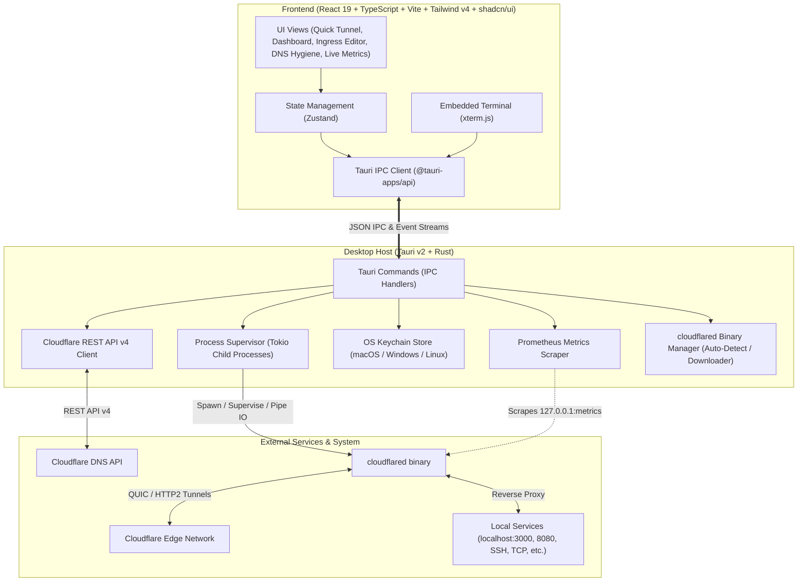

# Teitunnel Architecture & System Design

Teitunnel is an open-source, production-grade desktop control center for **Cloudflare Tunnels (`cloudflared`)**. It bridges local developer workflows, production server daemons, and Cloudflare's Edge network into a unified, native desktop interface.

---

## 1. High-Level Architecture

---

## 2. Core Subsystems

### 2.1 Binary Detection & Self-Managed Fallback
To ensure Teitunnel works out-of-the-box on any machine:
1. **System Detection**:
   - Searches `$PATH` and standard locations (`/opt/homebrew/bin/cloudflared`, `/usr/local/bin/cloudflared`, `/usr/bin/cloudflared`, `C:\Program Files\cloudflared`).
   - Executes `--version` to verify compatibility.
2. **Auto-Download & Update (Managed Binary)**:
   - If missing or outdated, Teitunnel can download the latest official release directly from Cloudflare's GitHub releases to the app support folder (`~/.teitunnel/bin/cloudflared`).
   - Automatically sets executable permissions (`chmod +x` on Unix) and verifies SHA256 checksum.

### 2.2 Dual Tunnel Modes

#### A. Remotely-Managed (Zero Trust API) Mode — *Primary*
- Uses a scoped Cloudflare API Token (`Cloudflare Tunnel: Edit`, `DNS: Edit`, `Account: Read`, `Zone: Read`).
- Tunnel tokens are generated via `/accounts/{id}/cfd_tunnel/{tunnel_id}/token`.
- Execution: `cloudflared tunnel run --token <TOKEN>`.
- Ingress rules are managed remotely via Cloudflare's Edge API (`/configurations`).
- **No local YAML drift**: The source of truth resides on the Cloudflare edge.

#### B. Quick Ephemeral Tunnel ("Try Instantly") Mode
- Executes: `cloudflared tunnel --url http://localhost:<port>`.
- Does not require a Cloudflare account or API token.
- Parses the generated `https://*.trycloudflare.com` URL in real-time from process stdout/stderr.
- Renders instant shareable links, QR codes, and live traffic logs.

### 2.3 Process Supervision & Live Telemetry
- **Process Supervisor**:
  - Implemented in Rust with `tokio::process::Command`.
  - Captures `stdout` and `stderr` asynchronously line-by-line.
  - Emits real-time log events to the frontend via `app.emit("tunnel-log", ...)`.
  - Handles graceful shutdowns (`SIGTERM` with `SIGKILL` timeout fallback).
- **Prometheus Metrics Scraper**:
  - Passes `--metrics 127.0.0.1:<dynamic_port>` to `cloudflared`.
  - Periodically scrapes the Prometheus endpoint to extract:
    - Active edge connections & edge colos (e.g. SJC, FRA, LHR).
    - Round-Trip Time (RTT) latency.
    - Total request counts and HTTP response status codes (2xx, 4xx, 5xx).

### 2.4 The "No-Mess" DNS Engine & Hygiene Scanner
1. **Automated Provisioning**:
   - Creating a public hostname route automatically calls Cloudflare DNS API (`POST /zones/{zone_id}/dns_records`) to provision a proxied CNAME record pointing to `<tunnel_uuid>.cfargotunnel.com`.
2. **Cascade Deletion**:
   - Deleting a route or tunnel prompts to clean up the associated DNS record, ensuring zero lingering records.
3. **DNS Hygiene Scanner**:
   - Queries all CNAME records in the selected zone.
   - Filters for targets ending in `.cfargotunnel.com`.
   - Compares the target UUID against active tunnels in the account.
   - Flags orphaned records and allows 1-click batch cleanup.

### 2.5 Security & Credential Isolation
- **No Plaintext Storage**: Cloudflare API tokens are stored securely in the native operating system keychain using the Rust `keyring` crate:
  - macOS: **Apple Keychain Services**
  - Windows: **Windows Credential Manager**
  - Linux: **Secret Service API / libsecret**
- Sensitive tokens never touch plaintext configuration files.

---

## 3. Technology Stack

- **Desktop Framework**: Tauri v2
- **Backend Language**: Rust 1.98+ (Tokio, reqwest, keyring, serde)
- **Frontend Framework**: React 19 + TypeScript 5+ + Vite 8
- **Styling**: Tailwind CSS v4 + shadcn/ui primitives (Radix UI)
- **Terminal Emulator**: `@xterm/xterm` + `@xterm/addon-fit`
- **Charts & Graphs**: Recharts
- **State Management**: Zustand
- **Notifications**: Sonner (in-app toasts) + Tauri native OS notifications
